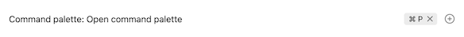
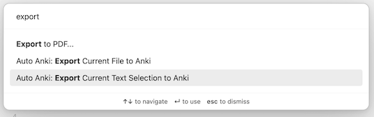
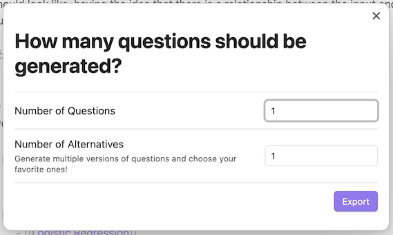
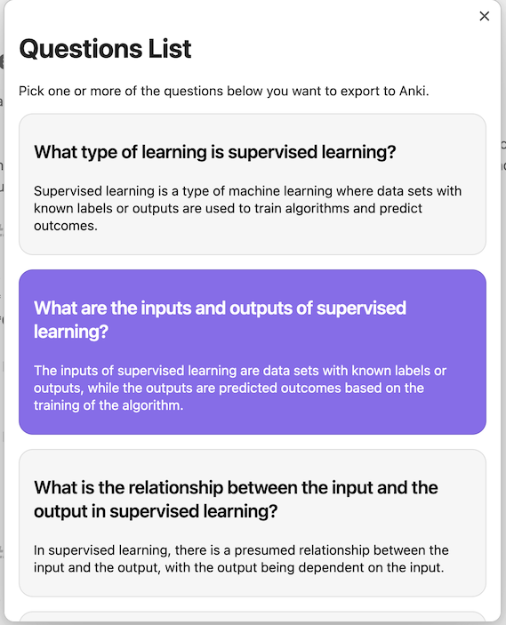

# Obsidian Auto Anki

Plugin for [Obsidian.md](https://obsidian.md/) that uses AI models (OpenAI GPT or Ollama) to automatically generate Flashcards for Anki.

> The plugin **only works for desktop**.

The plugin introduces two new "commands" into obsidian:
- _Export Current File to Anki_
- _Export Highlighted Text to Anki_ (only available in an active `Editable` window open - i.e. you need to have a document open, and it needs to be in `edit` mode)

The command palette can be accessed on Obsidian through the following hotkey (default): `CMD` + `SHIFT` + `P`

.

If desired, you can set your own hotkeys for the new commands.

The two new commands look like the following:

## Plugin Requirements

The following are required for the Plugin to work:

### AI Provider
Choose one of the following AI providers:

**Option 1: OpenAI (Cloud-based)**
- An [OpenAI](https://openai.com/) Account and an [OpenAI API Key](https://platform.openai.com/account/api-keys)

**Option 2: Ollama (Local/Self-hosted)**
- [Ollama](https://ollama.ai/) installed and running on your local machine or server
- A compatible model installed (e.g., `ollama pull llama3.2` or `ollama pull mistral`)
- For multimodal support: Vision models like `ollama pull llama3.2-vision:11b`

### Anki Setup (Required for both options)
- The [Anki](https://apps.ankiweb.net/) program, installed locally
- [Anki Connect](https://github.com/FooSoft/anki-connect), to expose an Anki API for Obsidian to make calls to

## Plugin Setup

1. Download and install the plugin (Options > Community Plugins)
2. Ensure that you have all the requirements in the [Plugin Requirements](#plugin-requirements)
3. Go to the Plugin Settings (Settings > Community Plugins > Auto Anki) and configure:
   - Anki Port (by default, this is `8765`)
   - AI Provider: Choose between "OpenAI" or "Ollama"
   - **For OpenAI**: Enter your OpenAI API Key
   - **For Ollama**: Set the Ollama Base URL (default: `http://localhost:11434`) and Model name (e.g., `llama3.2`)
   - **Multimodal Support** (optional): Enable to process images alongside text using vision models
4. Enjoy!

### Ollama Setup Guide

If you choose to use Ollama (local AI), follow these steps:

1. **Install Ollama**: Visit [ollama.ai](https://ollama.ai/) and download Ollama for your platform
2. **Install a Model**: Run `ollama pull llama3.2` (or another model like `mistral`, `codellama`, etc.)
3. **Start Ollama**: Run `ollama serve` to start the Ollama server (usually runs on http://localhost:11434)
4. **Configure Plugin**: In the Auto Anki settings:
   - Set AI Provider to "Ollama"
   - Set Ollama Base URL to `http://localhost:11434` (or your server URL)
   - Set Ollama Model to the model you installed (e.g., `llama3.2`)

**Benefits of Ollama:**
- ✅ Works completely offline
- ✅ No API costs
- ✅ Privacy-focused (your notes never leave your device)
- ✅ Supports many open-source models
- ✅ Vision models available (llama3.2-vision) for multimodal support

## New: Multimodal Support

The plugin now supports **multimodal capabilities** with vision models like Llama 3.2 Vision! This allows you to generate flashcards from content that includes both text and images.

### Key Features:
- 📸 **Image Processing**: Automatically detects and processes images in your markdown notes
- 🧠 **Vision Models**: Supports Llama 3.2 Vision (11B/90B) and GPT-4 Vision
- 🎯 **Smart Questions**: Generates questions about both textual and visual content
- ⚙️ **Configurable**: Enable/disable, adjust image size limits, specify vision models
- 🔄 **Backward Compatible**: Text-only processing works exactly as before

### Quick Start with Multimodal:
1. Install a vision model: `ollama pull llama3.2-vision:11b`
2. Enable "Multimodal Support" in plugin settings
3. Set "Vision Model" to `llama3.2-vision:11b`
4. Add images to your notes using `` syntax
5. Generate flashcards as usual!

For detailed setup and usage instructions, see [MULTIMODAL_GUIDE.md](MULTIMODAL_GUIDE.md).

## Feature Details

#### Exporting an Entire File to Anki (Command: _Export Current File to Anki_)
This command allows you to use the contents of the currently-opened file to send to your chosen AI provider and generate a list of questions and answers.

Alternatively, you can also specify the _number of alternatives_ to generate for each question. This allows you more variety in the "questions and answers" generated by AI and it allows you to choose among a larger number of alternative "questions and answers". Choosing a number of alternatives work best with smaller notes.

From the generated list of "questions and answers", you have the option to pick and choose the ones you want.

After picking and choosing, your selected "questions and answers" automatically imports the chosen questions to Anki, based on the details in your Plugin settings.

> It may take a while if you are generating a large number of questions, or a large number of question alternatives.
An indicator will show whether `auto-anki` is currently generating your flash cards. This is shown in the status bar at the bottom of the screen, like below:

#### Exporting Highlighted Text to Anki (Command: _Export Highlighted Text to Anki_)
This command is similar to "Exporting an Entire File to Anki", but this allows you to use the currently-highlighted text (instead of the whole file) to send to GPT and generate a list of questions and questions. (Important Note: file needs to be in `edit` mode for the command to be available).

#### Exporting Media Files to Anki (Command: _Export Current Media File to Anki_)
**NEW!** This command allows you to generate flashcards directly from standalone media files (images, PDFs, etc.) when viewing them in Obsidian. This feature requires multimodal support to be enabled.

**Supported File Types:**
- Images: JPG, JPEG, PNG, GIF, BMP, WebP
- Documents: PDF
- Configurable through plugin settings

**How to Use:**
1. Enable "Multimodal Support" in plugin settings
2. Configure your vision model (e.g., `llama3.2-vision:11b` for Ollama)
3. Open any supported media file in Obsidian
4. Use the command "Export Current Media File to Anki"
5. The AI will analyze the file content and generate relevant questions

This is perfect for:
- 📊 Analyzing charts, graphs, and diagrams
- 📄 Processing PDF documents and slides  
- 🖼️ Learning from visual content and infographics
- 🔬 Studying scientific figures and illustrations

## Motivation

With the kajillion things I read and watch on a daily basis, I've recently found myself struggling to retain knowledge of the things I've consumed. Hence, I've found myself trying to find new ways to enhance my self-education. I came upon [Spaced Repetition](https://en.wikipedia.org/wiki/Spaced_repetition), and wanted to try to use [Anki](https://apps.ankiweb.net/) to supplement my daily learnings. Being a long-time user and lover of [Obsidian.md](https://obsidian.md/) as my PKM (Personal Knowledge Management), I wanted to see if there was a way to automate my learning using spaced repetition with my current Obsidian vaults.

I looked at other [similar plugins](https://github.com/Pseudonium/Obsidian_to_Anki) that attempt to connect Obsidian to Anki, but a lot of require you to change how you write your notes in Obsidian, or just don't seem automated enough. What this plugin does is automate the creation of ["flashcard-style" questions and answers](https://en.wikipedia.org/wiki/Leitner_system) but without needing to format your notes for this purpose.

I consider myself a complete beginner when it comes to Spaced Repetition, Anki, or the general world of learning techniques, so I am always very open to suggestions, discussions, or any comments about the topic!

## Issues, Discussion, etc

I keep track of all things related to this plugin mostly in [issues](https://github.com/ad2969/obsidian-auto-anki/issues). Feel free to report bugs and/or requests there!
